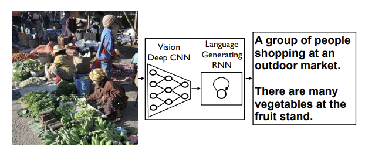
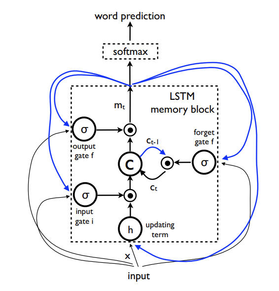
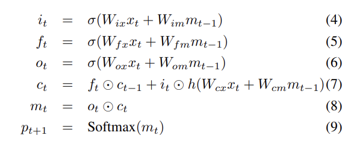
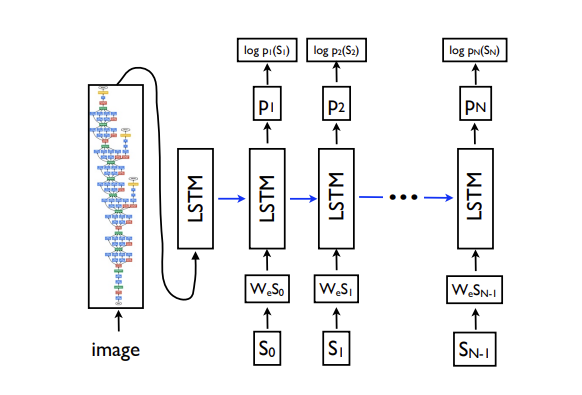
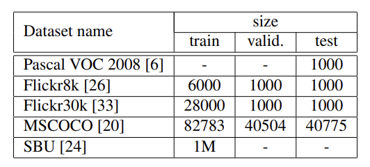
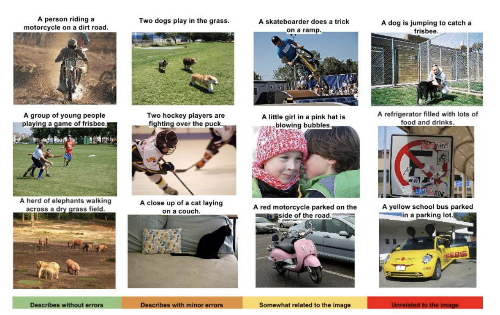
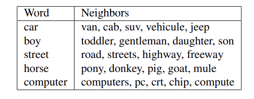

## Abstract
* 이미지의 내용을 설명하는 task는 컴퓨터 비전과 자연어 처리를 결합하여 해결했다. 
* 본 논문에서는 컴퓨터 비전(CNN)과 기계 번역을 결합한 RNN 아키텍처를 기반으로 한 Generative model을 제시한다. 
* 모델은 training 이미지에 대한 target description sentence의 likelihood를 최대화하도록 학습한다. 
* 우리의 모델은 양적평가(BLEU 등), 질적평가에서 모두 뛰어났다.

## 1. Introduction
* 적절한 문장을 사용하여 이미지의 내용을 자동으로 설명하는 것은 기존의 컴퓨터 비전의 image classification이나 object detection보다 훨씬 어려운 task이다.
* 이미지에 포함된 객체뿐만 아니라 객체들 사이의 관계, 속성 및 관련된 활동들을 자연어로 표현할 수 있는 language model이 필요하다.  

### END-TO-END 시스템
* 이전의 이미지 description을 만들어내는 시도에서는 이미지를 설명하기 위해 하위 문제에 대한 기존 해결책을 연결하는 방법(to stitch together existing solutions of the above sub-problems)을 제안했었다.
* 본 논문에서는 이미지(I)를 입력으로 하여 단어 시퀀스를 생성하는 likelihood p(S|I)를 최대화하는 단일 결합 모델을 제시한다.  
👉 END-TO-END로 한 번에 문제를 해결한다. SGD를 사용해 전체 신경망을 학습시킨다. 

> Figure1. 우리의 Neural Image Caption(NIC) 모델은 이미지를 입력으로 받는 CNN에 RNN을 이은 Neural net으로, end-to-end를 기반으로 한다.  
 
* 기존 RNN을 활용한 방식: “encoder” RNN이 source sentence를 읽고 이를 fixed-length vector representation으로 바꾼다. “decoder” RNN이 그에 기반하여 target sentence를 만들어 낸다.
* 여기에서는 기존 방식에서 encoder RNN을 CNN으로 대체했다. 
    * CNN은 input image를 fixed-length vector로 임베딩함으로써 이미지에 대한 우수한 representation을 만들어 낸다. 
* 이미지 분류를 목적으로 pre-train된 CNN의 last hidden layer를 decoder RNN의 input으로 넣어 sentence를 만들어내는 형식의 구조이다. 즉 기존의 sentence를 받던 모델에서 input이 (convolution 연산을 거친) image로 바뀐 것이다. 
* 이미지 input이 들어오면 바로 target sequence of words의 likelihood를 maximize 할 수 있는 single joint model(end-to-end 시스템)을 선보이고자 한다. 이를 Neural Image Caption(NIC)라 부른다.
* 전체 neural net이 SGD를 이용하여 학습된다. target sentence의 likelihood를 최대화하는 방식으로 학습한다.
* 결과 이렇게 함으로써 기존보다 훨씬 뛰어난 성능을 보였다. Pascal dataset에서 기존 모델의 BLEU 점수(높을 수록 좋음)가 25 였던 반면 NIC는 59점을 기록하여, 사람의 점수 69와도 비교할만한 성능을 보였다. 또한 더큰 corpora에 pre-trained되어 더 좋은 성능을 기대할 수 있다.

## 2. Related Work
생략

## 3. Model
* 본 연구는 source 언어 S를 target 언어 T로 변환하는 p(T|S)를 최대화하는 기계 번역에서 가장 큰 영감을 얻었다. end-to-end 방식으로 correct translation의 확률을 최대화시키는 방식이 학습과 추론에서 모두 좋다고 알려져 있다. 
* 이미지 캡셔닝에서도 위와 동일한 접근 방식을 사용한다.
    * 주어진 이미지에 대해 correct description에 대한 확률을 maximize하도록 한다. 식으로 나타내면 다음과 같다.

> 인풋 이미지 I가 주어졌을 때 correct description S의 확률을 최대화 할 수 있는 parameter θ를 구하는 것이 목표이다. 

* 이때 description S는 길이가 정해지지 않은 임의이 문장이다. N개의 단어를 갖고 있는 실제 답(description)에 대한 확률은 다음과 같이 S0,..,SN까지의 확률을 결합확률로 나타낸다.

> 훈련 시 (S, I)가 쌍으로 주어지며, SGD를 사용하여 최적화한다. 
* RNN으로 p(St|I, S0, ..., St-1)를 모델링하고, t-1번까지 조건화하는 단어의 가변적인 수는 고정된 길이의 hidden state $h_t$로 표현된다. 
    * 이때 $h_t$는 비선형 함수 f에 의해 다음과 같이 업데이트된다.

> hidden state의 업데이트 식

* f로는 vanilla RNN이 아닌, 뛰어난 성능을 보인 LSTM을 사용했다.
* image representation으로는 CNN을 사용했다.

### 3.1 LSTM-based Sentence Generator
* LSTM은 vanilla RNN에서 발생하는 vanishing gradient문제를 잘 해결한다. 

* LSTM은 매 input마다 업데이트 되는 memory cell C가 핵심 요소이다. 
* cell C는 3개의 gate가 각각 곱해지며 통제를 받는데, gate가 0이면 값을 반영을 하지 않고, 1이면 반영을 하는 형태이다. 
    * 3개의 gate는 각각 현재의 cell 값을 ‘잊을지 말지’를 통제하는 forget gate(f), 어떤 input을 반영해줄지를 통제하는 input gate(i), 어떤 것을 output으로 내보낼지를 통제하는 output gate(o)가 있다.

> 게이트의 수식은 위와 같다. 위의 수식에선 hidden state를 $m_t$로 나타냈다. $m_t$에 softmax를 씌워 모든 단어에 대한 확률 분포 $p_t$를 생성한다.

#### Training
* 이러한 구조를 가진 LSTM은 이미지와 이전까지의 단어(S0부터 St−1)를 토대로 다음단어(St)를 예측해내도록 학습된다. 

> LSTM을 unfold된 그림으로 그리면 위와 같다. 각각의 LSTM은 parameter를 공유한다.

* $S_t$는 각각 dictionary size의 차원인 one-hot vector이다. S0과 SN은 각각 시작과 끝을 나타내는 special stop word로 지정하였다. 
* 각각의 단어 S에 word embedding We를 해줌으로써 CNN을 통한 image representation과 word가 같은 차원에 있도록 하였다. 

* 이때의 loss는 각 step에서의 negative log likelihood의 합이다.

* Loss를 최소화 시키는 방향으로 LSTM의 parameter와 word embedding We, CNN의 image embedding을 하는 top layer를 학습한다.

#### inference
sentence를 만드는 방법은 여러 가지가 있다. 
* 첫번째 방법은 p1에 따라 첫번째 단어를 만들고, 이를 다시 input으로 넣어 p2를 만들고, 이를 end-of-sentence 토큰이 나오거나 최대 길이가 될 때까지 반복하는 **Sampling**기법이 있다.
* 두번째로는 매 t번째까지의 input으로 만들어진 최적의 문장 k개를 후보로 저장하고 또 그 후보들로 만든 t+1번째까지의 문장 중 k개의 문장을 반환하는 **BeamSearch** 기법이 있다.
* 여기에선 BeamSearch 방식으로 실험을 진행하였고, k=20으로 하였다. k=1일 경우 결과의 BLEU수치는 평균적으로 2점정도 내려갔다.

## 4. Experiments
### 4.1 Evaluation Metrics
* image description에 대한 평가 척도로 BLEU가 가장 많이 쓰인다. 이는 reference sentence와 얼마나 비슷한지로 답을 평가하는데, 구체적으로는 몇 개의 n-gram이 reference sentence와 겹치지를 통해 평가한다. 
* 우리는 BLEU를 이용하였고 이때의 reference sentence와 우리의 generated output은 다음에서 확인할 수 있다. http://nic.droppages.com/

### 4.2 Datasets

* SBU를 제외하고는 모두 ‘5개의 문장’ 라벨이 있다. SBU는 Flikcr에서 유저들이 올린 description이므로 noise가 심한 편이다. 
* Pascal 데이터는 test를 위해서만 사용하였는데, 나머지 4개의 data set으로 학습을 하고 평가를 하는 식으로 사용되었다.

### 4.3 Results
#### 4.3-1 Training Details
* supervised approach는 많은 데이터를 필요로하지만, 최상의 이미지는 10만개뿐이었다. 고로 데이터가 더 많아지면 더 좋은 결과를 낼것이라 기대한다.
* overfitting을 방지하기 위해 ImageNet을 통해 pretrained된 CNN으로 weight initialize를 하였다. word embedding We도 pretrained된 것을 써보았으나 효과가 없었다.
* CNN을 제외한 weight은 randomly initialized했다. 
* 모든 weight은 SGD로 학습시키고, learning rate은 고정시켰다.
* embedding size와 LSTM size는 512로 같다.
* ovrfitting을 방지하기 위해 dropout과 ensemble model을 사용했지만 BLEU에서 큰 향상을 보이진 못했다.
* hidden unit과 depth를 다양하게 설정했다.

#### 4.3-2 Generation Results

> Table1은 여러 평가 척도로 내본 성능 결과이다. Table2는 이전 연구들의 모델, 그리고 사람과의 성능 비교 결과이다.

* Table1을 보면 사람보다 좋은 결과가 있는데 실제 비교에선 이만큼 잘하진 못했으므로, 평가척도 역시 더 많은 연구가 필요하다. 평가지표는 선행 연구들에서 많이 사용되던 BLEU-4로 하였다.
* Table2에서 BLEU는 5명의 사람들이 만들어낸 description을 토대로 만든 BLEU를 평균낸 것이다.

#### 4.3-3 Transfer Learning, Data Size and Label Quality
한 data set에서 만들어진 모델을 다른 data set에서 평가해서(transfer) domain의 mismatch에도 불구하고 high quality data, more data로 극복가능한지 보았다.

* 같은 유저그룹에 의해 만들어져 label이 비슷할 것인 Flickr 30과 Flickr 8로 transfer learning을 해보았다. Flickr 30로 학습하였을 경우(데이터가 4배 정도 많다) Flickr 8에서 BLEU가 4점 올랐다. 이는 많은 데이터에 기반한 overfitting 방지의 역할을 한 듯하다.

* MSCOCO는 Flickr 30보다도 5배 더 크지만, mismatch도 더 큰 데이터인데, 이 경우 BLEU가 10점 내려갔다. 그러나 여전히 준수한 description을 보였다. 마지막으로 SBU는 크기가 크지만 사람이 만든 description이 아닌 단순 캡션, 즉 좋지 못한 labeling이었는데 MSCOCO로 학습한 모델을 SBU에 돌려보았을때 28점에서 16점으로 떨어졌다.

#### 4.3-4 Generation Diversity Discussion
generating의 관점에서, 모델이 새로운 caption을 만들어냈는지, 다양하고 high quality인지 보고자 하였다.

* Beam Search방법에서 N개의 best를 뽑았다. 다양한 단어, 다양한 관점에서 문장이 만들어졌다. 이 중 볼드체는 training set에 없었던 문장들이다. 
* 상위 15개의 새로 생성된 문장들을 보았을 때는 58점 정도로, 사람과 견줄만한 수준이었고, 절반정도가 새로운 description이었다. 
* 따라서 다양하고 high quality의 문장을 만들어냈다고 볼 수 있다.

#### 4.3-5 Ranking Results
우리는 좋지 않은 평가 방법이라 생각했지만 다른 연구들이 많이 썼던 ranking score도 써봤는데, 여기서도 좋은 점수가 나왔다.

#### 4.3-6 Human Evaluation
몇 개의 test set에 대해 사람이 바로 평가를 내렸다.

* 이때 ground truth에 대해 reference sentence 점수차도 많이 나는 것을 보아 BLEU가 완벽한 평가지표가 아님을 알 수 있다.

#### 4.3-7 Analysis of Embeddings
이전 단어 St−1을 LSTM의 input으로 넣어주기 위해 사용한 word embedding은 one-hot-encoding과 다르게 dictionary size에 제한되지 않는다.(!) 따라서 다른 모델들과 함께 jointly trained될 수 있다. 다음은 학습된 embedding space에서 근접이웃들의 몇가지 예시이다.

이렇게 model에서 학습된 관계는 vision component에도 도움을 줄 수 있는데, horse와 pony, donkey를 비슷한 위치에 있음으로 CNN이 horse-looking 동물의 feature를 extract하는 것이 더 수월해진다.(!) 아주 극단적인 케이스, 예를 들어 유니콘(unicorn)이 제시되어도 다른 word embedding과의 근접성으로 인해 추가적인 정보를 줄 것이다.(라고 가정을 했다.)

## 5. 추가 제언
추가로 이미지와 텍스트가 각각 있는 unsupervised data에서 image description의 성능을 향상시킬 수 있는 방법을 연구하는 것도 흥미로울 것이당.